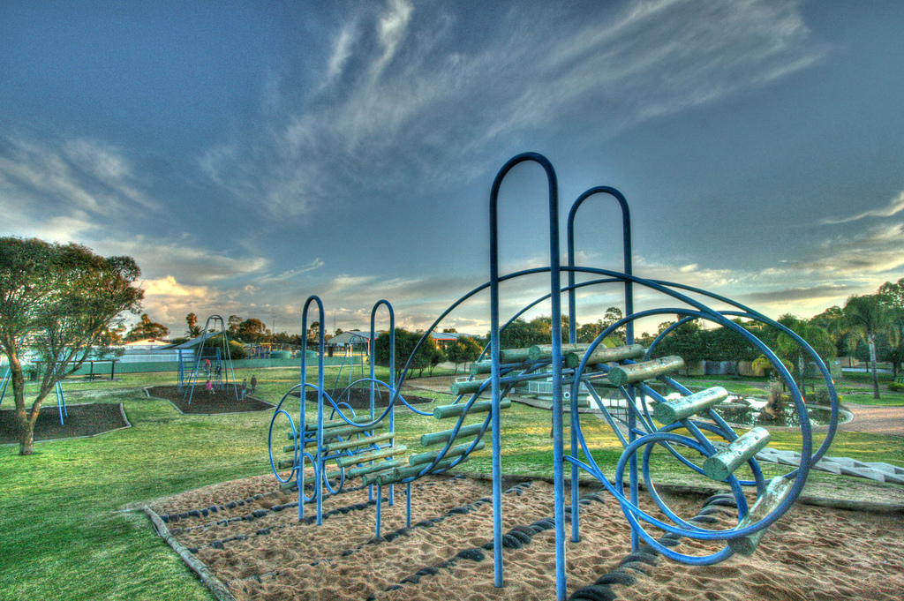

# Impactathon
####A project to enable mentally disabled children to fully enjoy public playgrounds.
Sarika Bajaj, Namrita Murali, Gaurav Lahiry, Ananya Chandra, Anand Kapadia

## Product Specification

* The goal: Make a headphone and glove set that will respond to stickers placed in an playground environment, interacting with disabled children to help them focus on a single sense at once and enjoy themselves.

* Two parts
  * Bluetooth headphones hidden in a headband that will play music/sound according to location/sticker that is closest
  * Gloves that will pulse at a certain beat based on sticker location
  * A “sticker” that will relay a different “number” of info, or will it relay a song/pulsing signal?

For the future, images can be added like this:

## Bill of Materials

## Hardware Specifications

## Software Specifications

## Presentation Description

This is a test